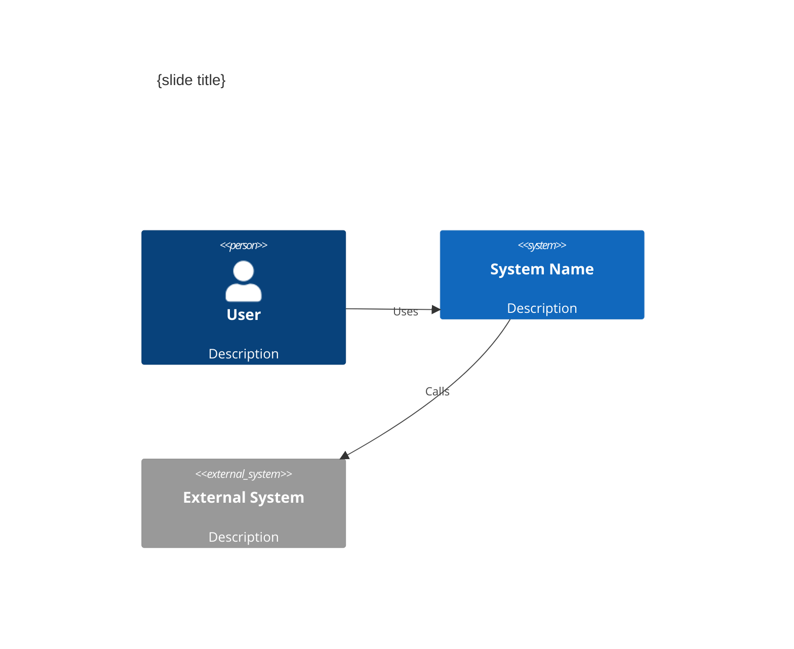
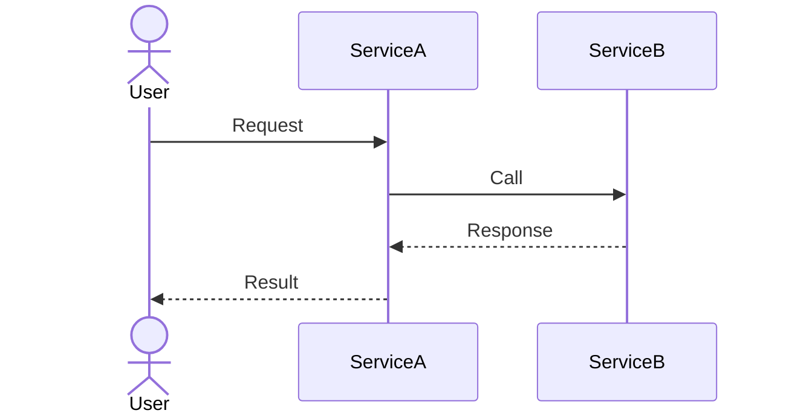
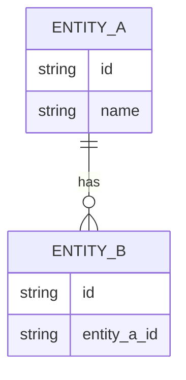

## User Input

```text
$ARGUMENTS
```

**Examples**:

- *(empty)* — audit mode: scan `spec.md` for `diagram: TBD` and report what's missing
- `--slide 5` — generate a Mermaid diagram for slide 5 based on its content and view type
- `--slide 5 "show the three replicas behind the load balancer"` — generate with a specific instruction
- `--all` — generate diagrams for every slide with `diagram: TBD`
- `--from-ad` — extract and assign diagrams from `AD.md` to matching slides
- `--simplify 7` — strip implementation detail from slide 7's existing diagram for the target audience
- `--type 5 c4` — force a specific diagram type for slide 5
- `--to-prompt 5` — convert slide 5's Mermaid to an AI image prompt (writes `image_prompt` in spec)
- `--prompt 5 "three pods behind an ingress, dark background"` — set/overwrite the image prompt for slide 5 manually
- `--generate 5` — interactive: pick model → call API → preview image in session → confirm → upload to ImgBB → save link

### Flags

| Flag | Description |
|---|---|
| *(no args)* | Audit: list all `diagram: TBD` and `diagram: none` slides, suggest diagram types |
| `--slide N [instruction]` | Generate/edit Mermaid for slide N; instruction is optional free-form guidance |
| `--all` | Generate Mermaid for every `diagram: TBD` slide in one pass |
| `--from-ad` | Extract diagrams from `AD.md`, match to slides by view/id, assign `diagram:` fields |
| `--simplify N` | Take slide N's existing diagram, strip detail inappropriate for the audience |
| `--type N graph\|sequence\|c4\|er\|state` | Force a Mermaid diagram type for slide N |
| `--to-prompt N` | Convert slide N's Mermaid block to a natural-language AI image prompt |
| `--prompt N "text"` | Set or overwrite the image prompt for slide N with user-authored text |
| `--generate N` | Interactive image generation: model selection → API call → in-session preview → confirm → ImgBB upload |
| `--model NAME` | Skip model selection question; force a specific model for `--generate` |
| `--dry-run` | Print what would be generated/changed without writing any files |

## Goal

Fill `diagram: TBD` slots in `presentation/spec.md` with appropriate Mermaid diagrams, saving each one to `presentation/diagrams/slide-NN.mmd` and updating the spec's `diagram:` field to point at it.

This is an **intelligent design step** — it decides *what* to draw. Embedding the diagram into `slides.md` is `implement`'s job.

## Outline

1. Load `spec.md` and `source.json`
2. Dispatch by mode (audit / single slide / all / from-ad / simplify / to-prompt)
3. For each target slide: infer diagram type → synthesize Mermaid → validate → write
4. Update `spec.md` `diagram:` fields
5. Print summary

---

## Execution Steps

### Phase 0 — Guard Check

Read `presentation/spec.md`. If missing or empty:

> "spec.md is not ready. Run `/presentation.specify` first, then `/presentation.clarify` to confirm the spec before drawing diagrams."

Stop.

### Phase 1 — Load Context

```bash
# Required
presentation/spec.md        # source of truth — slide content + diagram: fields
presentation/source.json    # scope, audience, source type

# If source is AD-based, also read:
AD.md                       # for --from-ad and diagram extraction
```

From `spec.md` frontmatter, extract: `audience`, `scope`, `view_ordering`, `perspectives`, `image_style`.

From `source.json`, extract: `source_type`, `sources.ad.path` (if present).

### Phase 2 — Dispatch by Mode

---

#### Mode A — Audit (no flags)

Scan every slide in `spec.md` for:

| Condition | Finding |
|---|---|
| `diagram: TBD` | Needs a diagram — suggest type |
| `diagram: none` | No diagram — verify this is intentional (meta/title slides are fine) |
| `diagram:` points to `AD.md#anchor` | Check the anchor exists in AD.md |
| `diagram:` points to `diagrams/slide-NN.mmd` | Check the file exists |

Print an audit table:

```markdown
## Diagram Audit

| Slide | Title | View | Current diagram: | Recommended type | Priority |
|-------|-------|------|-----------------|------------------|----------|
| 04 | System Context | context | TBD | C4Context | HIGH |
| 07 | Deployment Topology | deployment | TBD | graph TD | HIGH |
| 09 | Request Flow | operational | TBD | sequenceDiagram | MEDIUM |
| 12 | Data Model | information | none | erDiagram | LOW |

4 diagrams needed. Run `/presentation.draw --all` to generate all, or `--slide N` one at a time.
```

Stop here — do not generate unless a generation flag is given.

---

#### Mode B — Single Slide (`--slide N [instruction]`)

1. Load slide N from `spec.md` (title, view, key_message, bullets, speaker_notes)
2. Load audience + scope from spec frontmatter
3. Infer diagram type (see **Type Selection Heuristic** below) — override with `--type`
4. Synthesize a Mermaid block (see **Diagram Synthesis** below)
5. Write `presentation/diagrams/slide-NN.mmd`
6. Update slide N's `diagram:` field in `spec.md`: `diagram: presentation/diagrams/slide-NN.mmd`
7. Append to `## Change Log` in spec

---

#### Mode C — All (`--all`)

Run Mode B for every slide with `diagram: TBD`, in spec order.

Batch summary at end:

```markdown
## Diagrams generated

- Slide 04 (context) → C4Context — presentation/diagrams/slide-04.mmd
- Slide 07 (deployment) → graph TD — presentation/diagrams/slide-07.mmd
- Slide 09 (operational) → sequenceDiagram — presentation/diagrams/slide-09.mmd

3 diagrams written. spec.md updated.
Next: `/presentation.implement` to render slides.md.
```

---

#### Mode D — From AD (`--from-ad`)

Pull diagrams that already exist in `AD.md` and wire them to the matching slides.

1. Scan `AD.md` for fenced Mermaid blocks — extract each one along with its heading context
2. For each block: identify which view it belongs to (context, functional, deployment, etc.)
3. For each slide in `spec.md` with `diagram: TBD`: find the best-matching AD.md block by view + keyword overlap
4. Two sub-cases:
   - **Direct use**: diagram is already appropriately detailed → set `diagram: AD.md#heading-anchor`
   - **Extract + simplify**: diagram is too detailed for the audience → copy to `diagrams/slide-NN.mmd`, run simplification (same as Mode E), point spec at the copy
5. Slides with no match in AD.md keep `diagram: TBD` — report them for follow-up with `--slide N`

---

#### Mode E — Simplify (`--simplify N`)

Take slide N's existing diagram (from `AD.md` or `diagrams/slide-NN.mmd`) and produce a presentation-appropriate version:

**Simplification rules** (driven by audience):

| Audience | Strip | Keep |
|---|---|---|
| exec/CTO | IP addresses, port numbers, internal hostnames, env vars, replicas count | Component names, trust boundaries, data flow direction |
| arb | Implementation details, infra specifics | All architectural decisions, component roles, key dependencies |
| dev-team | Business/cost context | Full technical detail (minimal simplification) |
| devops/SRE | Business context, UI components | Infra, networking, deployment topology in full |

Steps:
1. Parse the Mermaid block
2. Drop/rename nodes and edges per the audience rule
3. Preserve the structural story (same flow, same components — just less noise)
4. Write simplified version to `diagrams/slide-NN.mmd` (or overwrite if already there)
5. Update `diagram:` field if it was pointing at AD.md

---

#### Mode F — To Prompt (`--to-prompt N`)

Convert slide N's Mermaid block to a natural-language AI image prompt. This is a **read-and-write** operation on the spec — it does not generate an image.

1. Locate the Mermaid block via slide N's `diagram:` field
2. Parse diagram type + nodes + edges (same logic as `implement --mermaid-to-prompt`)
3. Synthesize a natural-language image prompt:

   ```
   {image_style from spec}.
   Depicting {N} components: {node_labels joined, ≤5}.
   Their relationships: {edge descriptions as natural-language flow}.
   Layout: {LR → left-to-right pipeline | TD → top-down hierarchy | sequence → timeline}.
   16:9, minimal text labels, focus on visual hierarchy.
   ```

4. Write to `spec.md` slide N's `image_prompt:` field
5. Write/update `presentation/prompts/slide-NN.prompt.md`
6. Do NOT modify the `diagram:` field — both can coexist (Mermaid as fallback, image prompt for generation)

---

#### Mode G — Set/Edit User Prompt (`--prompt N "text"`)

Let the user author the image prompt directly — bypasses Mermaid conversion and AI synthesis.

1. Accept the prompt text from the argument (required; error if empty)
2. Write to `spec.md` slide N's `image_prompt:` field — overwrites any existing value
3. Write `presentation/prompts/slide-NN.prompt.md`:

   ```markdown
   # Slide {NN} — {title}

   **Style**: {image_style from spec.md}
   **Aspect**: 16:9
   **Negative**: text, watermarks, logos

   **Prompt**:
   {user-provided text}

   **Source**: user-authored

   **Context**:
   - Slide key message: {key_message}
   - View: {view}
   - Audience: {audience}
   ```

4. Append to `## Change Log`: `- {date} draw: slide NN — image_prompt set by user`
5. Print: `Prompt saved for slide NN. Next: /presentation.draw --generate NN`

---

#### Mode H — Interactive Image Generation (`--generate N [--model NAME]`)

Full interactive loop: model selection → API call → in-session preview → confirm → ImgBB upload → link saved.

##### Step 1 — Prompt check

Verify slide N has `image_prompt:` in `spec.md`. If missing:
> "Slide N has no image prompt. Run `--to-prompt N` (from Mermaid) or `--prompt N "..."` (manual) first."
> Stop.

##### Step 2 — Model selection

Unless `--model` is given, ask via `AskUserQuestion`:

```
Which image model should generate slide N?

○ gemini-2.5-flash-image   Fast, good quality, free-tier friendly  (Recommended)
○ gemini-2.5-pro-image     Higher quality, slower, higher quota cost
○ dall-e-3                 OpenAI — strong 16:9 support, ~$0.04/image
○ Other — type model name
```

Resolve API key for the chosen provider (same chain as `implement`):
- Gemini: `GEMINI_API_KEY` → `GEMINI_API_KEYS` → `.googleAI-token` → `.gemini-api-key`
- OpenAI: `OPENAI_API_KEY`

If no key found for the chosen provider, say so and suggest alternatives.

##### Step 3 — Generate

Call the provider API with the prompt from `prompts/slide-NN.prompt.md`.

- Aspect: 16:9 (1792×1024 for DALL-E; closest supported for Gemini)
- On 429: rotate through `GEMINI_API_KEYS` if multiple; otherwise surface the error

Save image bytes to `presentation/assets/images/slide-NN.png`.

##### Step 4 — In-session preview

Display the generated image inline by reading the saved PNG — Claude's multimodal rendering shows it to the user.

Then ask:

```
## Generated image — Slide N: {title}

[image shown above]

Model: {model used}
Prompt: "{first 80 chars}..."

○ Looks good — upload to ImgBB and save link  (Recommended)
○ Retry — adjust prompt first
○ Retry — try a different model
○ Skip — keep local path only, don't upload
```

##### Step 5 — Retry loop

**Adjust prompt**: ask "What to change?", apply edit to `spec.md` + prompt file, go to Step 3.

**Different model**: go to Step 2.

Cap at 3 retries per invocation.

##### Step 6 — ImgBB upload

If user confirms:

1. Upload `presentation/assets/images/slide-NN.png` to ImgBB → receive URL
2. Add `image_url: https://i.ibb.co/...` to slide N in `spec.md`
3. Archive the prompt in the prompt file:
   ```markdown
   <!-- image_prompt:archive index=NN b64=<base64url> -->
   ```
4. Append to `## Change Log`:
   ```markdown
   - 2026-05-26 draw: slide 07 — generated (gemini-2.5-flash-image), uploaded → https://i.ibb.co/xxxxx/slide-07.png
   ```

If `IMGBB_API_KEY` is absent:
> "No IMGBB_API_KEY — image saved locally at `presentation/assets/images/slide-NN.png`. Add key to `.env` to enable remote upload."

##### Step 7 — Summary

```markdown
## Image ready — Slide 7: Deployment Topology

- Model: gemini-2.5-flash-image
- Local:  presentation/assets/images/slide-07.png
- Remote: https://i.ibb.co/xxxxx/slide-07.png  ← saved in spec.md

Next: `/presentation.implement` to embed all images into slides.md.
```

---

### Phase 3 — Diagram Type Selection Heuristic

When no `--type` is given, select by `view` field:

| View | Default type | Rationale |
|---|---|---|
| `context` | `C4Context` | System-boundary + external actor map |
| `functional` | `graph LR` | Component relationships, horizontal flow |
| `information` | `erDiagram` | Data model, entity relationships |
| `concurrency` | `sequenceDiagram` | Time-ordered interactions |
| `development` | `graph TD` | Module / layer hierarchy |
| `deployment` | `graph TD` or `C4Container` | Infrastructure topology (C4 if AD uses C4) |
| `operational` | `sequenceDiagram` | Request/event flow through running system |
| `perspectives` | `graph LR` | Cross-cutting concern map |
| `meta` (title/exec summary) | none | No diagram — skip |

If `source.json.sources.ad` is present and the AD uses C4 diagrams, prefer C4 types for context and deployment views.

---

### Phase 4 — Diagram Synthesis

For each slide being drawn, use this process:

1. **Extract facts** from the slide: title, key_message, bullets, view, speaker_notes
2. **Read the AD.md section** corresponding to the view (if `source_type: ad`)
3. **Draft a Mermaid block** matching the selected type — use only information present in the slide + AD; do not invent components
4. **Validate**: the Mermaid must be syntactically complete (balanced `{}`, correct node/edge syntax per type)
5. **Audience-gate**: apply simplification rules (Mode E level) appropriate to the spec's `audience` field

#### Synthesis skeletons by type

**C4Context**:


**graph LR** (functional/deployment):


**sequenceDiagram** (operational/concurrency):


**erDiagram** (information):


---

### Phase 5 — Write Outputs

For each diagram generated:

1. Create `presentation/diagrams/` if it doesn't exist
2. Write `presentation/diagrams/slide-NN.mmd` (UTF-8, no BOM)
3. Update `spec.md` — surgical edit of only the `diagram:` line for slide N
4. Append to `## Change Log`:
   ```markdown
   - 2026-05-26 draw: slide 07 — generated graph TD (deployment) from AD.md §3.6
   ```

### Phase 6 — Summary

```markdown
## Diagrams ready

| Slide | Title | Type | File |
|-------|-------|------|------|
| 04 | System Context | C4Context | diagrams/slide-04.mmd |
| 07 | Deployment Topology | graph TD | diagrams/slide-07.mmd |

2 diagrams generated. spec.md updated.

Remaining TBD: slide 12 (information view — no AD.md section found; run `/presentation.draw --slide 12 "describe the data model"`)

**Next**: `/presentation.implement` to embed diagrams into slides.md.
```

---

## Key Rules

- **No content invention.** Only use facts present in the spec slide and AD.md. Never add components or relationships that aren't in the source.
- **Spec is source of truth.** All writes go to `spec.md` and `diagrams/slide-NN.mmd`. Never write `slides.md` — that's `implement`'s job.
- **Surgical edits.** Only update the `diagram:` line for the target slide(s). Don't rewrite unrelated spec content.
- **Audience-appropriate detail.** Always simplify to the audience in spec frontmatter unless `--type` forces otherwise.
- **Preserve originals.** When simplifying an AD.md diagram, write the simplified copy to `diagrams/` — never modify AD.md.
- **Mermaid and image prompts coexist.** `--to-prompt` writes `image_prompt:` but keeps `diagram:` intact. Both are valid simultaneously.
- **Change log is mandatory.** Every draw pass appends entries.

## Context

{ARGS}
